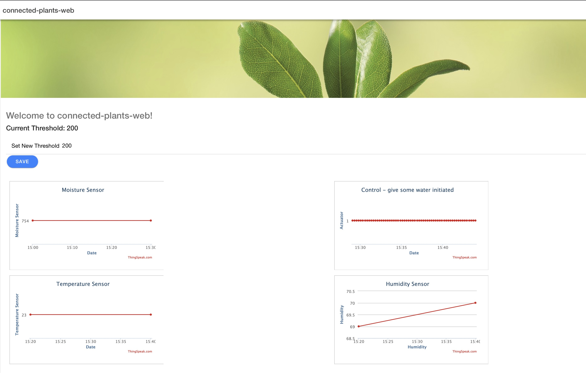

# IoT Engineering
## Project Connected Plants
A environmental sensor for your plants to monitor your plants health and get notified, whenever there is need for action. 

## Introduction
This project is part of the [IoT Engineering](../../../fhnw-iot) course.

* 2-person teams, building an IoT system.
* 32 hours of work per person, 1 prototype.
* 10' presentation of the project at Demo Day.
* Slides, source code and setup steps on GitHub.
* Both team members are able to explain the project.

### Team members
* [@Prinzenrolle90], Mischa Imbiscuso
* [@cudemo], Vito Cudemo

## Deliverables
Following deliverables are given: 

1) Reference model / Domain overview
2) Source code of ESP8266 plants service as well as cloud infrastructure code
3) Setup steps to start the whole project on your favorite machine
4) Short presentation
5) Live demo steps

### Use Case

This projects target was to create an ecosystem for monitoring plants. A Arduino enabled board has been used, together with sensors as well as actuators, to indicate when a plants moisture level reaches a 'dangerous' value. Following are some key data: 

* A Webservice gives the possibility to check all measured values. 
* The complete backend service for this setup runs as a cloud service. 
* The user gets a SMS / E-Mail notification, indicating that a plant is low on water. 
* The Arduino board can use WiFi or LoRaWAN connection, based on the given use case. 


### Reference model / Domain overview


### Hardware

* [Feather Huzzah ESP8266](https://github.com/tamberg/fhnw-iot/wiki/Feather-Huzzah-ESP8266)
* [Grove Particle Shield](https://github.com/tamberg/fhnw-iot/wiki/Grove-Adapters#grove-shield-for-feather)
* [Grove Moisture Sensor](http://wiki.seeedstudio.com/Grove-Moisture_Sensor/)
* [Temperature & Humidity Sensor (DHT11)](https://github.com/tamberg/fhnw-iot/wiki/Grove-Sensors#temperature--humidity-sensor)
* [Chainable RGB LED](https://github.com/tamberg/fhnw-iot/wiki/Grove-Actuators#chainable-rgb-led)
* [Raspberry Pi Zero W](https://github.com/tamberg/fhnw-iot/wiki/Raspberry-Pi-Zero-W)


### Source code
Source code consists of: Arduino device for sensor information, Java Service running on Tomcat with REST API and Ionic Webserver https://plants.imbiscuso.ch

* [PlantsFieldSensor for ESP8266](esp/PlantsFieldSensor/PlantsFieldSensor.ino)
* [Secrets File for PlantsFieldSensor](esp/PlantsFieldSensor/secrets.h)
* [Plants REST API](/connected-plants-rest/src/main/java/ch/fhnw/iot/connectedPlants/raspberry/PlantApplication/)
* [Plants Service (Java used on Raspberry or cloud)](/connected-plants-service/src/main/java/ch/fhnw/iot/connectedPlants/raspberry/) 
* [Plants Webservice (Angular)](/connected-plants-web)

Furthermore, we implemented an own MQTT Broker on a Raspberry Pi 3+, running hassio Home Assistant and DuckDNS Service for serving mqtt://mqtt.cudemo.ch:16290. The MQTT Service has been setup to only allow authenticated connections. User: esp / raspberry, password: iotmqtt
The Cloud runs with any MQTT broker.

You can find all the backend configuration files for the domains as well as hass.io mqtt broker under

* [Configs Webserver](configs-webserver/)


### Setup software
##### Feather Huzzah ESP8266 

1) Edit [secrets.h](esp/PlantsFieldSensor/secrets.h) to set your ThingSpeak API Keys and WIFI Settings 
2) Attach sensors and actuator to ESP8266 
* Sensors and Actuators:

Type | Name | Pin ESP8266
--- | --- | ---
Sensor |DHT11 Temperature & Humidity Sensor |D2 -> 2
Sensor |Grove Moisture Sensor |A0
Actuator |Chainable RGB LED |D4, D5 -> 0, 15

3) Attach to energy source and check ThingSpeak. Otherwise enable debug mode on ESP source-code

##### Cloud

The cloud consists of three separate projects. The service can be run on any operating machine and hardware with internet connection. For the projects purpose, we set up the whole project also on our private servers at home and using our private domains. 
The following setup steps are made for linux operating system:

** _connected-plants-rest_ - REST-API for Cloud, the bridge for Webservice and PlantsService. Setup: **
1) Install mongodb: ```sudo apt install mongodb-server mongodb-clients```
2) Connect to mongo: ```mongod```
3) Create databse: ```use connected_plants```
4) Insert initial entry: ```db.connected_plants.insert({threshold:0, measuredMoistureValue: 0, mqtt:"0", last:"01.01.1970 00:00:00"});```
5) Import [Plants REST API](/connected-plants-rest/src/main/java/ch/fhnw/iot/connectedPlants/raspberry/PlantApplication/) into IDE and start REST service.
6) This will start the REST API as well as Tomcat on Port 8888.
7) Important:  MongoDB Access can be configured in [application.properties](/connected-plants-rest/src/main/resources/application.properties) file.

** _connected-plants-service_ - Service is responsible for managing threshold, get ThingSpeak fields and write command for ESP using MQTT**
1) Import [Plants Service](/connected-plants-service/src/main/java/ch/fhnw/iot/connectedPlants/raspberry/) into IDE and start Plants Service
2) Important: ThingSpeak URL, AWS Login, MQTT Login, service intervall as well as MongoDB settings can be configured in [config.properties](/connected-plants-service/src/main/resources/config.properties) file.

** _connected-plants-web_ - Webservice to use on client. Thanks to the webservice, a user can change the threshold for any given plant he/she wants to monitor/water**
1) In terminal, change to directory [Plants Webservice (Angular)](/connected-plants-web)
2) Run following commands to start Webservice
```
npm install -g ionic
npm install -g angular
npm install
ionic serve
```
3) This will start the Webservice on Port 8100: http://localhost:8100/
4) Important: URL of REST service can be configured under [config.js](/connected-plants-web/src/assets/). 



### Sequence diagram

Summarized, the sequence diagram now looks as follows:


### Presentation
4-slide presentation, PDF format, committed to (this) project repo.
Working end-to-end prototype, "device to cloud", part of your 10' presentation.

[MY_TEAM_PROJECT_PRESENTATION.pdf](MY_TEAM_PROJECT_PRESENTATION.pdf)

1) Use-case of your project.
2) Reference model of your project.
3) Single slide interface documentation.
4) Issues you faced, how you solved them.

### Live demo

[Connected Plants Webservice - https://plants.imbiscuso.ch](https://plants.imbiscuso.ch)

1) ESP8266 is used in field to monitor plants.
2) Every x minutes, the ESP sends the sensor data to ThingSpeak API.
3) The Webservice (written in Angular) displays all relevant information to the user and gives the possibility to set the threshold for moisture-sensor based on plant.
4) The Plants Service monitors the threshold as well as the sensor information from ThingSpeak API. 
5) If the threshold is reached, the Service sents the "1" signal to the ESP using MQTT service, which was set up on a Raspberry Pi 3+ running hassio home assistant: mqtt.cudemo.ch. This signal is being repeated until the threshold is back to normal. 
6) Furthermore, the service sents an SMS and/or e-mail notification to the users.
7) The ESP then reacts to the event. 
8) If the sensor information is higher than the threshold defined via webservice, the Plants service reacts to it by sending the "0" signal to the ESP using MQTT. 


## Submission deadline
Commit and push to (this) project repo before Demo Day, _03.06.2019, 00:00_.

## Bibliography
* https://www.instructables.com/id/ESP8266-Soil-Moisture-Sensor-With-Arduino-IDE/
