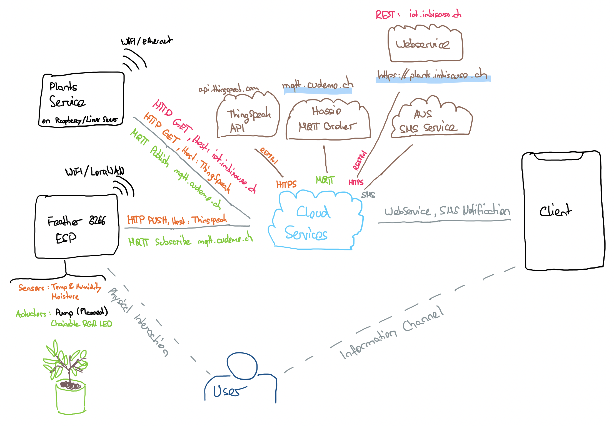

# IoT Engineering
## Project Connected Plants
A moisture and environmental sensor for your plants to get a information, whenever there is need for action. 

## Introduction
This project is part of the [IoT Engineering](../../../fhnw-iot) course.

* 2-person teams, building an IoT system.
* 32 hours of work per person, 1 prototype.
* 10' presentation of the project at Demo Day.
* Slides, source code and setup steps on GitHub.
* Both team members are able to explain the project.

### Team members
* [@Prinzenrolle90], Mischa Imbiscuso
* [@cudemo], Vito Cudemo

## Deliverables
The following deliverables are mandatory.

### Source code
Source code consists of: Arduino, Java Service and Angular Webserver

[PlantsFieldSensor for ESP8266](esp/PlantsFieldSensor/PlantsFieldSensor.ino)

[Plants Service Java used on Raspberry or cloud](/raspberry-java/src/main/java/ch/fhnw/iot/connectedPlants/raspberry/) 

[Plants Webservice used on Webserver](/connected-plants-web/src)

### Reference model (has to be updated)

##### Setup software
* Edit [secrets.h](esp/readSensorTest/secrets.h) to set your ThingSpeak API Keys and WIFI Settings 

### Presentation
4-slide presentation, PDF format, committed to (this) project repo.

[MY_TEAM_PROJECT_PRESENTATION.pdf](MY_TEAM_PROJECT_PRESENTATION.pdf)

1) Use-case of your project.
2) Reference model of your project.
3) Single slide interface documentation.
4) Issues you faced, how you solved them.

### Live demo
Working end-to-end prototype, "device to cloud", part of your 10' presentation.

[Connected Plants Webservice - https://plants.imbiscuso.ch](https://plants.imbiscuso.ch)

1) ESP8266 is used in field to monitor plants.
2) Every x minutes, the ESP sends the sensor data to ThingSpeak API.
3) The Webservice (written in Angular) displays all relevant information to the user and gives the possibility to set the threshold for moisture-sensor based on plant.
4) The Java Service takes the threshold and monitors the sensor information from ThingSpeak API. 
5) If the threshold is reached, the Service sents the "Give some water" signal to the ESP using MQTT service, which was set up on a Raspberry Pi 3+ running hassio home assistant: mqtt.cudemo.ch
6) Furthermore, the service sents an SMS to the users.
7) The ESP then reacts to the event. 

## Submission deadline
Commit and push to (this) project repo before Demo Day, _03.06.2019, 00:00_.

## Bibliography
* https://www.instructables.com/id/ESP8266-Soil-Moisture-Sensor-With-Arduino-IDE/